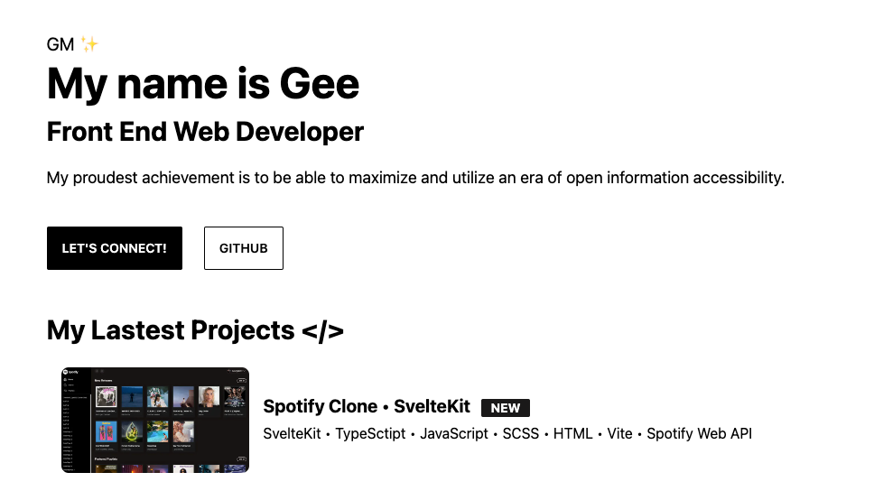

# Gee's Personal Website ✨



A _minimal_ • _personal_ • _digital space_ to showcase my works with Projects, Playground, Blog, and CV ✨

## Demo

View a live demo of the [Gee's Personal Website](https://gee-astro-personal.vercel.app/)

## Installation

Run the following command in your terminal

```bash
npm install
```

Once the packages are installed you are ready to run astro. Astro comes with a built-in development server that has everything you need for project development. The astro dev command will start the local development server so that you can see your new website in action for the very first time.

```bash
npm run dev
```

## Tech Stack

- [Astro](https://astro.build)
- [Scss](https://sass-lang.com/)
- [TailwindCSS](https://tailwindcss.com/)
- [DaisyUI](https://daisyui.com/)
- [Vite](https://vitejs.dev/guide/)

## Project Structure

```TS
├── public/
│   ├── Banner-01000111_Landing.Page.png
│   ├── Banner-01000111.jpeg
│   ├── Banner-Gee.Personal.Site.png
│   ├── Banner-SvelteKit_Spotify.Clone.png
│   ├── Blog-Post1_Banner.png
│   ├── Blog-Post2_1.png
│   ├── Blog-Post2_Banner.png
│   ├── favicon.svg
│   ├── itemPreview.png
│   ├── post_img.webp
│   └── profile.jpg
│   └── robots.txt
├── src/
│   ├── components/
│   │   ├── cv/
│   │   │   └── TimeLine.astro
│   │   ├── BaseHead.astro
│   │   ├── Card.astro
│   │   ├── Footer.astro
│   │   ├── Header.astro
│   │   ├── HorizontalCard.astro
│   │   └── SideBar.astro
│   ├── content/
│   │   ├── blog/
│   │   │   ├── post1.md
│   │   │   └── post2.md
│   │   └── config.ts
│   ├── layouts/
│   │   └── BaseLayout.astro
│   │   └── PostLayout.astro
│   └── pages/
│   │   ├── blog/
│   │   │   └── [..page].astro
│   │   │   └── [slug].astro
│   │   ├── 404.astro
│   │   ├── about.astro
│   │   ├── cv.astro
│   │   ├── index.astro
│   │   ├── main.ts
│   │   ├── playground.astro
│   │   └── projects.astro
│   └── styles/
│     └── global.css
├── astro.config.mjs
├── tailwind.config.cjs
├── package.json
└── tsconfig.json
```

### Components usage

#### • Layout Components

The `BaseHead`, `Footer`, `Header` and `SideBar` components are already included in the layout sistem. To change the website content you can edit the content of this components.

#### • SideBar

In the Sidebar you can change the links to all your website pages.

- You can change your avatar shape using [mask classes](https://daisyui.com/components/mask/).
- The used social-icons are SVG form [BoxIcons](https://boxicons.com/) pack.

> **Note**: In order to change the sidebar menu's active item style, look for the `activeClass` constant and change its value to your desired style (e.g. `active` for the primary colour).

#### • TimeLine

The timeline components are used to conform the CV.

```html
<div class="time-line-container">
  <TimeLineElement
    title="Element Title"
    subtitle="Subtitle"
    desc="Description"
  />
  ...
</div>
```

#### • Card & HorizontalCard

```html
<HorizontalCard title="Card Title" img="imge_url" desc="Description" url="Link
URL" target="Optional link target (_blank default)" badge="Optional badge"
tags={['Array','of','tags']} />
```

---

### Layouts

Include `BaseLayout` in each page you add and `PostLayout` to your post pages.

---

### Content

You can add a [content collection](https://docs.astro.build/en/guides/content-collections/) in `/content/` folder, you will need add it at config.ts.

#### • config.ts

Where you need to define your content collections, we define our content schemas too.

#### • Blog

Add your `md` blog post in the `/content/blog/` folder.

#### • Post format

Add code with this format in the top of each post file.

```TS
---
title: "Post Title"
description: "Description"
pubDate: "Post date format(Sep 10 2022)"
heroImage: "Post Hero Image URL"
---
```

---

### Pages

#### • Static pages

The other pages inlcuded in the template are static pages. The `index` page belong to the root page. You can add your pages directly in the `/pages` folder and then add a link to that pages in the `sidebar` component.

> Feel free to modify the content included in the pages that the template contains or add the ones you need.

#### • Blog

Blog uses Astro's content collection to query post's `md`.

##### [page].astro

The `[page].astro` is the route to work with the paginated post list. You can change there the number of items listed for each page and the pagination button labels.

##### [slug].astro

The `[slug].astro` is the base route for every blog post, you can customize the page layout or behaviour, by default uses `content/blog` for content collection and `PostLayout` as layout.

---

### Theming

For change the template theme change the `data-theme` atribute of the `<html>` tag in `BaseLayout.astro` file.

You can chose among 30 themes available or create your custom theme. See themes available [here](https://daisyui.com/docs/themes/).

---

## Sitemap

The Sitemap is generated automatically when you build your website in the root of the domain. Please update the `robots.txt` file in the public folder with your site name URL for the Sitemap.

---

## Deployment

You can deploy your site on your favorite static hosting service such as Vercel, Netlify, GitHub Pages, etc.

The configuration for the deployment varies depending on the platform where you are going to do it. See the [official Astro information](https://docs.astro.build/en/guides/deploy/) to deploy your website.

> **⚠️ CAUTION** </br>
> The Blog pagination of this template is implemented using dynamic route parameters in its filename and for now this format is incompatible with SSR deploy configs, so please use the default static deploy options for your deployments.

---

## Contributing

Suggestions and pull requests are welcomed! Feel free to open a discussion or an issue for a new feature request or bug.

One of the best ways of contribute is to grab a [bug report or feature suggestion](https://github.com/manuelernestog/astro-modern-personal-website/issues) that has been marked `accepted` and dig in.

Please be wary of working on issues _not_ marked as `accepted`. Just because someone has created an issue doesn't mean we'll accept a pull request for it.

## License

Astro Modern Personal Website is licensed under the MIT license — see the [LICENSE](https://github.com/manuelernestog/astro-modern-personal-website/blob/main/LICENSE) file for details.

## Contributors

<a href="https://github.com/manuelernestog/astro-modern-personal-website/graphs/contributors">
  
</a>

Made with [contrib.rocks](https://contrib.rocks).
